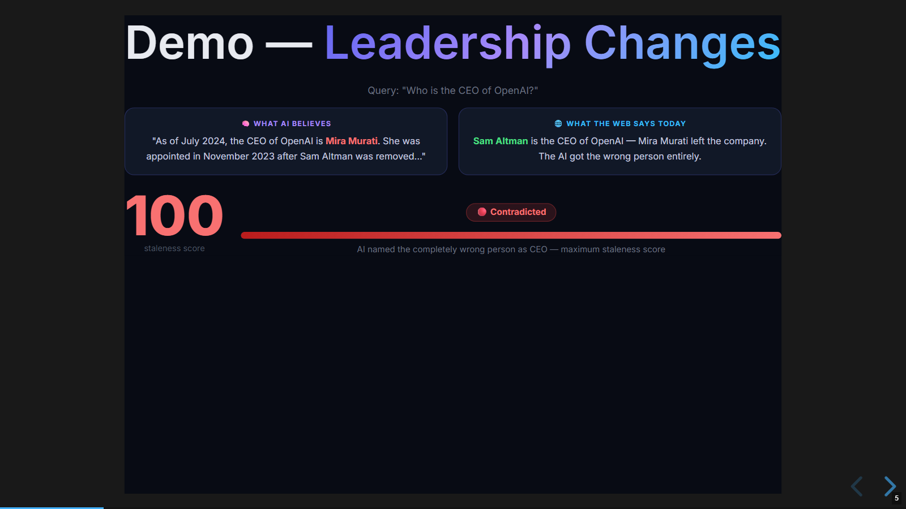
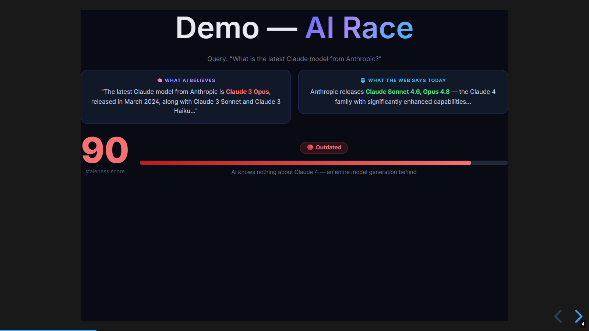
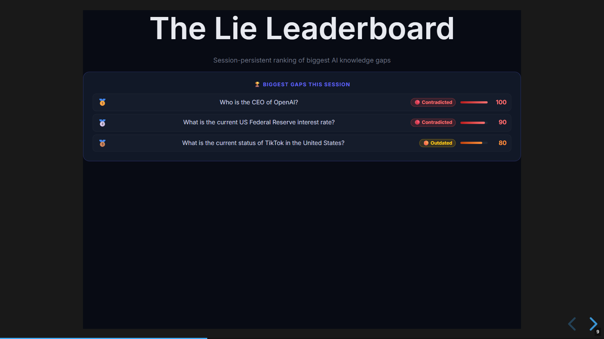

# ⚡ SERP Delta — LLM Knowledge Gap Detector

> **Your AI assistant isn't lying — it's just frozen in time. This shows you exactly where, and by how much.**

[](https://serpdelta-heenqfrqmf3fxfxvkhe8hn.streamlit.app/)

**[▶ Try the live demo →](https://serpdelta-heenqfrqmf3fxfxvkhe8hn.streamlit.app/)**

SERP Delta is a real-time LLM grounding tool that detects and quantifies knowledge staleness by comparing AI answers against live Google search results. Ask any time-sensitive question, get a **Staleness Score (0–100)**, a verdict, specific discrepancies, and a visual knowledge decay timeline.

Built for the [SerpApi Hackathon](https://hackathon.serpapi.com).



*AI confidently named the wrong OpenAI CEO — score 100/100, Contradicted. Caught in 3 seconds.*

---

## Screenshots

| Score Card | Lie Leaderboard |
|---|---|
|  |  |

## What It Does

| Feature | Description |
|---|---|
| **Staleness Score** | 0–100 numeric score — 0 = perfectly fresh, 100 = completely contradicted |
| **Verdict** | Fresh / Slightly Outdated / Outdated / Contradicted / Unverifiable |
| **Side-by-side comparison** | AI's training-data answer vs. live Google snippets |
| **Discrepancies** | Specific "AI says X, but web says Y" findings |
| **Knowledge Decay Timeline** | Visual bar showing exactly how many months behind the AI is |
| **Live vs. Cached badge** | Shows whether results were fetched live or served from disk cache |
| **Lie Leaderboard** | Session-persistent ranking of biggest AI knowledge gaps |
| **Recent Headlines** | Live news results for full context |
| **People Also Ask** | Related questions from Google |
| **JSON Export** | Download full analysis for enterprise/pipeline use |
| **SerpApi quota meter** | Sidebar usage bar with calls remaining |

---

## Architecture

```
                         ┌─────────────────────────────────────────┐
                         │              User Query                  │
                         └──────────────┬──────────────────────────┘
                                        │
                         ┌──────────────┴──────────────┐
                         │       Parallel execution      │
                         │    (ThreadPoolExecutor x2)   │
                         └──────────────┬──────────────┘
                                        │
              ┌─────────────────────────┴──────────────────────────┐
              │                                                      │
   ┌──────────▼──────────┐                          ┌──────────────▼─────────────┐
   │   LLM Answer Call   │                          │    get_live_context()       │
   │  (Nebius Qwen3-32B) │                          │   ┌──────────────────────┐  │
   │   llm_cache/ 7d TTL │                          │   │  ThreadPoolExecutor  │  │
   └──────────┬──────────┘                          │   │  ┌────────┐┌───────┐ │  │
              │                                     │   │  │ Search ││  News │ │  │
              │                                     │   │  │SerpApi ││SerpApi│ │  │
              │                                     │   │  └────────┘└───────┘ │  │
              │                                     │   └──────────────────────┘  │
              │                                     │   serp_cache/ 24h TTL        │
              │                                     └──────────────┬──────────────┘
              │                                                    │
              └──────────────────────┬─────────────────────────────┘
                                     │
                          ┌──────────▼──────────┐
                          │   compute_delta()    │
                          │ (Nebius Llama 3.3 70B│
                          │  structured JSON out)│
                          └──────────┬──────────┘
                                     │
                 ┌───────────────────┼─────────────────────────┐
                 │                   │                          │
        ┌────────▼───────┐  ┌────────▼───────┐  ┌─────────────▼──────┐
        │  Score Banner   │  │   Timeline      │  │  Lie Leaderboard   │
        │  0-100 + Gauge  │  │  Decay Visual   │  │  Session Ranking   │
        └─────────────────┘  └─────────────────┘  └────────────────────┘
```

### LLM Fallback Chain

Providers are tried in order — first success wins:

```
1. Nebius (primary)
   ├── get_llm_answer → Qwen/Qwen3-32B        (fast, no thinking mode)
   └── compute_delta  → Llama-3.3-70B-Instruct (capable, structured JSON)

2. Google Gemini Flash (fallback)
   └── gemini-2.0-flash via OpenAI-compatible endpoint

3. Ollama (local fallback)
   └── llama3.2 (or any model set in OLLAMA_MODEL)
```

### Caching Architecture

```
Request
  │
  ├─ st.cache_data (Streamlit) ──── 5-min in-memory ──► Instant repeat (same session)
  │
  ├─ llm_cache/   ──── 7-day disk ──► No LLM API call (training data is fixed)
  │
  ├─ serp_cache/  ──── 24h disk  ──► No SerpApi call (conserves free-plan quota)
  │
  └─ Live fetch   ──── Parallel Search + News ──► ~1.5s ──► Delta ──► ~3s total
```

---

## Components

| File | Purpose |
|---|---|
| `app.py` | Main Streamlit app — UI, routing, session state, all rendering |
| `llm.py` | LLM provider abstraction — fallback chain, answer cache, delta computation |
| `serp.py` | SerpApi integration — parallel Search + News, disk cache |
| `prompts.py` | System prompts for LLM answer and delta analysis |
| `warm_cache.py` | Script to pre-warm caches for all demo queries |
| `start.ps1` / `start.bat` | Launch the app (kills stale process, opens browser) |
| `stop.ps1` / `stop.bat` | Cleanly kill the app by port |
| `.streamlit/config.toml` | Streamlit dark theme configuration |

### Key Directories (git-ignored)

| Directory | Contents |
|---|---|
| `serp_cache/` | Disk-cached SerpApi responses (JSON, 24h TTL) |
| `llm_cache/` | Disk-cached LLM training-data answers (plain text, 7-day TTL) |
| `dev-notes/` | Bug log and learnings (not committed) |
| `demo/` | Presentation slides and demo script (not committed) |

---

## Installation

### Prerequisites
- Python 3.10+
- A [SerpApi](https://serpapi.com) account (free plan: 100 searches/month)
- A [Nebius AI Studio](https://studio.nebius.com) account (or Google AI Studio / Ollama)

### 1. Clone and install

```bash
git clone https://github.com/your-username/SerpDelta.git
cd SerpDelta
pip install -r requirements.txt
```

### 2. Configure environment

Copy `.env.example` to `.env` and fill in your keys:

```env
# Required
SERPAPI_KEY=your_serpapi_key_here
NEBIUS_API_KEY=your_nebius_key_here

# Nebius model config (defaults work out of the box)
NEBIUS_BASE_URL=https://api.studio.nebius.com/v1/
NEBIUS_CHAT_MODEL=meta-llama/Llama-3.3-70B-Instruct
NEBIUS_CHAT_MODEL_SMALL=Qwen/Qwen3-32B

# Optional fallbacks
GOOGLE_API_KEY=           # Gemini Flash fallback
OLLAMA_BASE_URL=http://localhost:11434/v1/
OLLAMA_MODEL=llama3.2

# Quota and cache settings
SERPAPI_SESSION_LIMIT=40  # max SerpApi calls per browser session (2 per query)
SERP_CACHE_TTL_HOURS=24   # disk cache TTL for SerpApi results
```

### 3. Modes of operation

| Mode | When | Behaviour |
|---|---|---|
| **Live mode** | API keys present (`.env`, session, or Streamlit secrets) | Full real-time queries — SerpApi + LLM |
| **Demo mode** | No API keys configured | Pre-loaded results for 9 preset queries; custom queries show closest match |

Keys are read in priority order: **UI session → `.env` / environment → Streamlit secrets → demo mode**.
Running locally with a `.env` file automatically activates live mode — no extra steps needed.

### 4. Run

**Windows (double-click or PowerShell):**
```powershell
.\start.ps1    # starts app + opens browser
.\stop.ps1     # stop
```

**Any platform:**
```bash
python -m streamlit run app.py --server.port 8501
```

App opens at **http://localhost:8501**

### 5. Deploy to Streamlit Cloud

1. Push repo to GitHub (already done — see repo link above)
2. Go to [share.streamlit.io](https://share.streamlit.io) → New app → connect repo
3. Add secrets in the Streamlit Cloud dashboard under **Settings → Secrets**:
   ```toml
   SERPAPI_KEY = "your_key"
   NEBIUS_API_KEY = "your_key"
   ```
   With secrets configured, the deployed app runs in **live mode** for all visitors.
   Without secrets, it runs in **demo mode** — still fully functional with 9 pre-loaded examples.

4. Visitors can also enter their own API keys in the **⚙️ Configure API Keys** sidebar panel — keys are stored in their browser session only, never sent to any server.

### 6. (Optional) Pre-warm caches

Run all demo queries ahead of a presentation so every query is instant:

```bash
python warm_cache.py
```

---

## Usage

### Built-in Demo Queries

The sidebar has 15 pre-configured queries across 5 categories, all chosen for large expected gaps:

| Category | Why dramatic gaps |
|---|---|
| 🤖 AI Race | Model versions change every few months |
| 💸 Markets & Crypto | Prices and rates move constantly |
| 🌍 Geopolitics | Policy situations evolve rapidly |
| 🏆 Sports | Past-cutoff events the AI cannot know |
| 👤 Leadership Changes | C-suite changes happen without warning |

### Reading the Results

| Score | Verdict | Meaning |
|---|---|---|
| 0–20 | ✅ Fresh | AI answer is accurate and current |
| 21–50 | 🟡 Slightly Outdated | Minor details changed, core answer holds |
| 51–75 | 🟠 Outdated | Significant facts have changed — answer misleads |
| 76–100 | 🔴 Contradicted | AI answer directly contradicts current reality |

### Exporting Results

Click **⬇ Export JSON Report** after any query to download the full analysis including LLM answer, live snippets, delta object, and headlines.

---

## API Keys

| Key | Where to get | Cost |
|---|---|---|
| `SERPAPI_KEY` | [serpapi.com](https://serpapi.com) | Free: 100 searches/month |
| `NEBIUS_API_KEY` | [studio.nebius.com](https://studio.nebius.com) | Pay-per-token |
| `GOOGLE_API_KEY` | [aistudio.google.com](https://aistudio.google.com) | Free tier available |

---

## How It Works — Technical Detail

1. **Query submitted** → `run_pipeline(query)` called (wrapped in `@st.cache_data(ttl=300)`)
2. **LLM answer** → checks `llm_cache/` first; if miss, calls Nebius Qwen3-32B, saves to cache
3. **Live web data** → checks `serp_cache/` first; if miss, runs Google Search + Google News **in parallel** via `ThreadPoolExecutor`, saves both to cache
4. **Delta analysis** → `compute_delta(query, llm_answer, live_data)` — calls Nebius Llama 3.3 70B with a structured prompt, extracts JSON with `staleness_score`, `verdict`, `what_changed`, `discrepancies`, `ai_likely_cutoff_hint`, `sources`
5. **Render** — score card, knowledge timeline, two-panel comparison, discrepancies, headlines, leaderboard
6. **Session tracking** — `serp_calls_used` and `serp_cache_hits` updated on main thread (never inside worker threads — Streamlit session state is not thread-safe)

---

## Performance

| Scenario | Latency |
|---|---|
| Streamlit in-memory cache hit | ~0ms |
| Both LLM + SERP from disk cache | ~2–3s (delta only) |
| SERP from disk, LLM cold | ~3–4s |
| Full cold (first ever run) | ~4–6s |

---

## Tech Stack

- **[Streamlit](https://streamlit.io)** ≥ 1.35 — UI framework
- **[SerpApi](https://serpapi.com)** — Google Search + Google News (live data)
- **[Nebius AI Studio](https://studio.nebius.com)** — Llama 3.3 70B + Qwen3-32B
- **[OpenAI SDK](https://github.com/openai/openai-python)** ≥ 1.30 — OpenAI-compatible client for all LLM providers
- **[python-dotenv](https://github.com/theskumar/python-dotenv)** — environment config

---

## License

MIT
